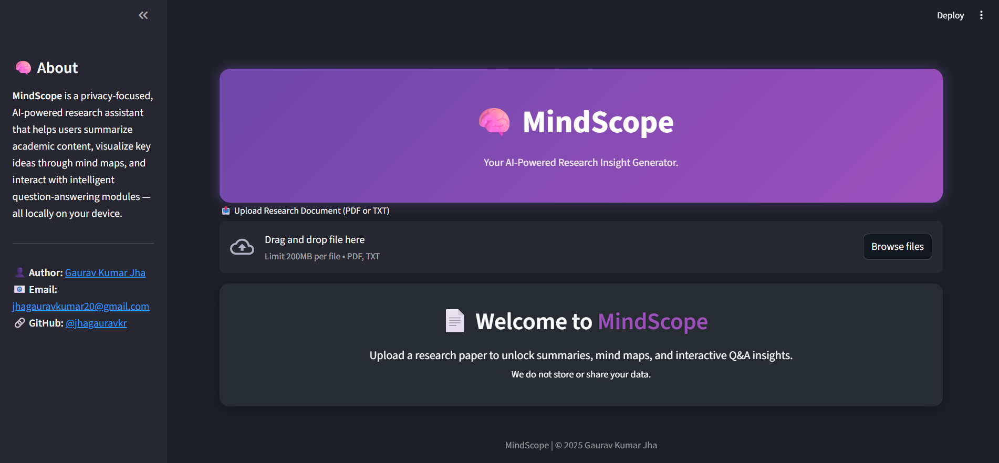

# 🧠 MindScope: AI Research Insight Generator

**MindScope** is a privacy-focused, AI-powered research assistant built using Streamlit and modern NLP models. It allows users to upload research documents (PDF or TXT), get concise summaries, visualize concept relationships through mind maps, ask intelligent questions, and test their comprehension — all processed locally without storing any data.

---

## 🚀 Features

- 📤 Upload and read PDF/TXT documents
- ✍️ Generate 80–150 word executive summaries
- 🧠 Visualize concept relationships using interactive Mind Maps
- ❓ Ask natural language questions about the content
- 🧪 Test your understanding with AI-generated comprehension questions
- ✅ Receive evaluation feedback on your answers (not based on word-to-word match)
- 🧾 View complete conversation history
- 🧑‍🎨 Modern dark UI with glassmorphism style
- 🔒 No data is stored or shared — runs fully local for privacy

---

## 🖼️ UI Preview

 


---

## 🚀 Live Demo

Try the deployed application here 👉 [MindScope AI (Streamlit App)](https://jhagauravkr-mindscope.streamlit.app/)

> No installation needed — open in browser and upload your research paper (PDF/TXT) to test summarization, Q&A, and comprehension features.


## 🧑‍💻 Tech Stack

- **Frontend**: [Streamlit](https://streamlit.io)
- **Models Used**: `roberta-base-squad2` (Hugging Face Transformers)
- **Summarization**: TextRank + Transformer-based methods
- **Visualization**: TF-IDF + TruncatedSVD + Graphviz
- **Answer Evaluation**: Semantic similarity scoring via QA pipeline
- **Styling**: Custom CSS (dark mode, animations, and layout)

---

## 🧠 Architecture & Reasoning Flow

The app follows a modular and explainable reasoning flow:

1. **Document Ingestion**:
   - User uploads a `.pdf` or `.txt` file.
   - The content is extracted using PyMuPDF (`fitz`) or basic text decoding.

2. **Text Summarization**:
   - The raw text is summarized into 80–150 words using TF-IDF and SVD-based extractive summarization.
   - Ensures a compact yet insightful executive summary.

3. **Mind Map Construction**:
   - Key terms are extracted using `TfidfVectorizer`.
   - A 2-level mind map is visualized using Graphviz, showing hierarchical relationships between concepts.

4. **Interactive Q&A**:
   - Users can ask custom questions related to the document.
   - An **extractive QA model** (`roberta-base-squad2`) finds the best justification span.
   - A **generative model** (`flan-t5-base`) converts it into a clear, full-sentence answer.

5. **Knowledge Testing (Comprehension Mode)**:
   - GPT-2 generates 3–5 logic-based questions from the document.
   - Users answer, and their response is compared to the model's expected answer using `sentence-transformers`.
   - Semantic similarity scoring is used to provide graded feedback (Excellent, Good, Almost There, Needs Improvement).

6. **User Feedback Loop**:
   - Conversation history is saved.
   - Users can regenerate questions or retry answers.
   - Answers are not compared word-for-word but based on **meaning similarity**, using embeddings.

Each module is designed to be explainable, modular, and beginner-friendly while still using advanced NLP under the hood.


---

## 🎥 Demo Video

Watch a quick walkthrough of **MindScope** in action:

[](https://youtu.be/JxIVDbjs9Qw)


---

## ⚙️ Setup Instructions

To run this project locally:

```bash
# Clone the repository
git clone https://github.com/jhagauravkr/MindScope.git
cd MindScope

# Set up virtual environment (recommended)
python -m venv venv
# On Windows:
venv\Scripts\activate
# On Mac/Linux:
source venv/bin/activate

# Install dependencies
pip install -r requirements.txt

# Launch the Streamlit app
streamlit run app.py


